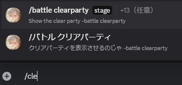
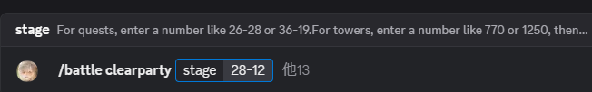
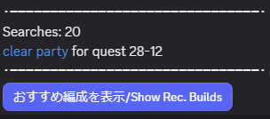
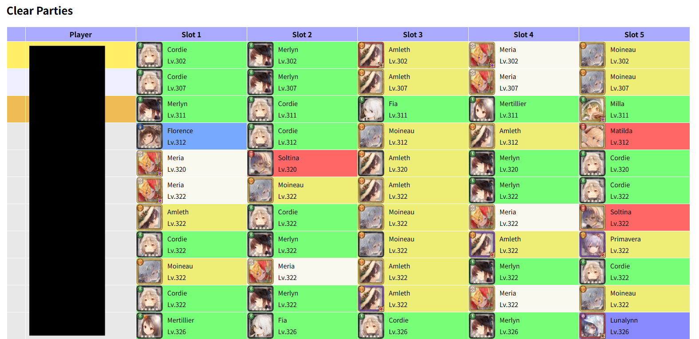
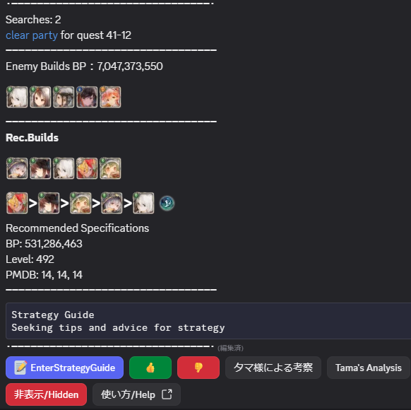
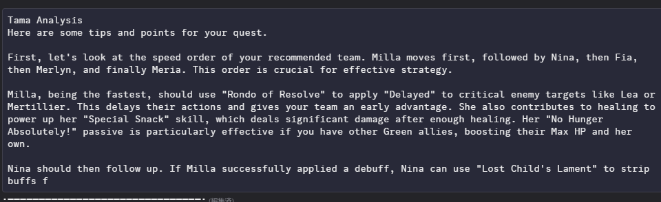

# Clear Party Command
[日本語](HelpClearPartyJP.md) 
## About the Command 
  
After typing "/" in the chat, a list of commands will appear.  
You can use the Clear Party command by typing "/clearparty" or "/cl".  
*It may take some time to retrieve the list.  
## How to Use 
  
After tapping on the "/Battle Clear Party" command that appears, enter the stage you want to view, for example, 28-12.  
Then, send the message, and after a short while, the clear parties will be displayed.  
For the Infinity Tower, enter the floor you want to view, for example, 902, then select < TowerType> at the top of the command, choose < InfinityTower>, and then send the message.   

## Execution Results 
  
・Search Count 
This shows the number of times the command has been executed for the searched stage, with data collected starting from August 1, 2025.  
You can check how frequently a stage is being searched.  
・Clear Party Link 
  
You can view an easy-to-understand screen on the linked website.  
・Recommended Display 
  
You can check for more detailed information.   

## Recommended Display 
・Enter a Strategy 
  
You can record a strategy of up to 1000 characters to show other players.  
・Analysis by Tama 
  
Tama will provide a strategy for you.  
The accuracy is continuously improved once a month.  
・About Likes 
Currently, the like function does not improve the analysis. It's just there.   

## Filtering and Specifying 
This command allows you to filter and specify results. In addition to < TowerType>, you can also specify < Server>, < World>, < PartyDisplayCount>, < BattleReportFunction>, < AttackPower>, < Physical/MagicalDefensePenetration>, < PlayerName>, < PlayerID>, < LevelLink>, < SortOrder>, and < Character>.  
### Specifying a Server 
parameter< Server>, you can choose between "All Worlds" and "Japan Only".  
The default is "All Worlds".  
This allows you to filter the worlds of the displayed clear parties.  

### Specifying a World 
parameter< World>, you can specify a world within the Japanese server. 
For example, enter "w1" for World 1, "w80" for World 80.  

### Clear Party Display Count 
parameter< PartyDisplayCount>, you can change the number of clear parties displayed.  
The more you display, the longer it will take.  
The default is 50.  

### Adding the Battle Report Function 
parameter< BattleReportFunction>, you can choose whether to add a feature that allows you to tap on a player's name in a clear party to go to the battle report screen.  
The default is disabled.  
For more details on the battle report function, please refer to the section "About the Battle Report Function".  

### Specifying Attack Power 
parameter< AttackPower>, you can specify a clear party where the character with the highest attack power has a value less than the specified value ("Actual Value" < "Specified Value").  
However, you must also specify a character.  

### Specifying Physical/Magical Defense Penetration 
parameter< Physical/MagicalDefensePenetration>, you can specify a clear party where the character with the highest physical/magical defense penetration has a value less than the specified value ("Actual Value" < "Specified Value").  
However, you must also specify a character.  

### Specifying a Player Name 
parameter< PlayerName>, you can specify a clear party by the player's name at the time of clearing, using an exact match.  

### Specifying a Player ID 
parameter< PlayerID>, you can specify a clear party by the player's ID at the time of clearing, using an exact match.  

### Specifying a Level Link 
parameter< LevelLink>, you can specify a clear party by the exact level link at the time of clearing.  

### Specifying a Sort Order 
parameter< SortOrder>, you can choose to sort by "Level", "Link", "Attack Power", or "Physical/Magical Defense Penetration".  

### Specifying a Character 
parameter< Character>, you can specify a single character.  
This character can be specified by Character ID, Character Name, Clifa Name, Title, or Lament Name.  
The specified character will always be present in the clear parties displayed.   

These filters can be combined.   

Enabling the Battle Report function during server congestion will require a significant amount of time.  
In that case, please reduce the display count.   