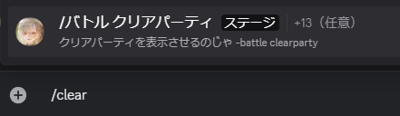
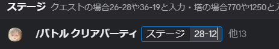
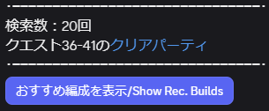
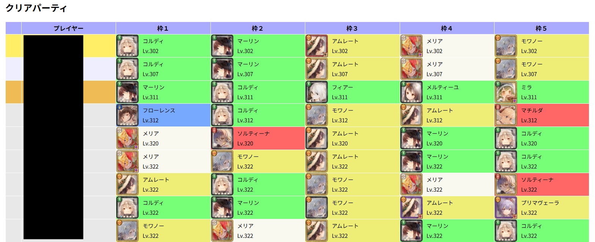
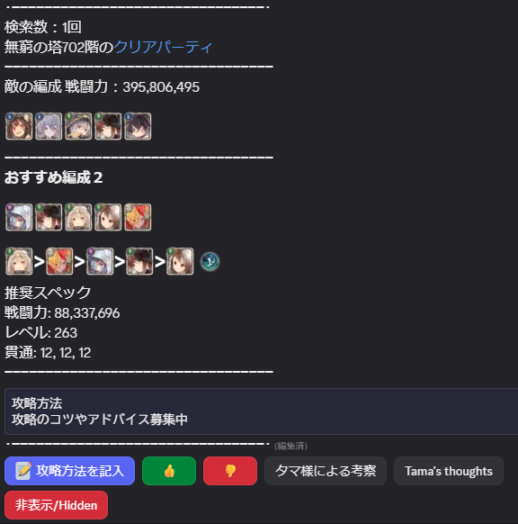
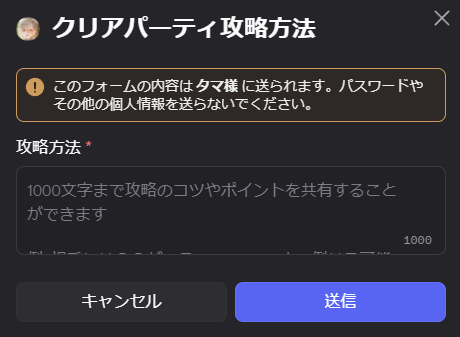
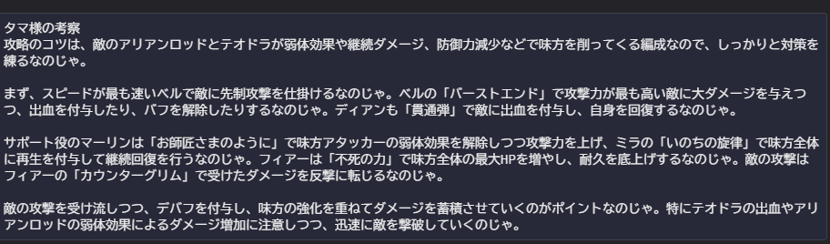

# クリアパーティコマンド
[English](HelpClearPartyEN.md) 
## コマンドについて
 
/をチャットに入力するとコマンド一覧が出てきます。/クリアパーティ もしくは/cl と入力するとクリアパーティコマンドを使うことが出来ます。 
※リストを取得するのに時間がかかります 
## 使い方
 
出てきた/バトル クリアパーティ をタップした後、見たいステージ、例えば 28-12 を入力します。その後送信してしばらくするとクリアパーティが表示されます。 
無窮の塔の場合、見たい階層、例えば 902 を入力した後にコマンド上部に出てくる<塔の種類>を選択し、<無窮の塔>を選んでから送信してください  

## 実行結果
 
・検索数 
2025年8月1日から集計開始した検索対象のコマンド実行回数です。 
どれくらい検索されているステージなのかを確認できます。 
・クリアパーティリンク 
 
サイト先ではわかりやすい画面を見ることができます。 
・おすすめ表示 
 
さらに詳細情報を確認することができます。  

## おすすめ表示
・攻略方法の記入 
 
1000文字まで攻略方法を記録することができ、他プレイヤーに見せることができます。 
・タマ様による考察 
 
タマが代わりに攻略方法を教えてくれます。 
精度は月に一度改善し続けます。 
・いいねについて 
現状いいねによる考察の改善機能はありません。 
ただそこにあるだけです。  

## 絞込み・指定方法
このコマンドでは絞込みや指定ができます。 
指定は<塔の種類>以外に<サーバー>,<ワールド>,<パーティ表示数>,<バトルレポート機能>,<攻撃力>,<物魔防御貫通>,<プレイヤー名>,<プレイヤーid>,<レベルリンク>,<並び順>,<キャラクター>があります。 

### サーバーの指定
<サーバー>では全ワールド、日本限定が選択できます。 
デフォルトは全ワールドです。 
出力されるクリアパーティのワールドを絞り込むことができます。 

### ワールドの指定
<ワールド>では日本のサーバー内のワールドを指定できます。 
出力されるクリアパーティのワールドを絞り込むことができます。 
例えば、w1→1,w80→80 

### クリアパーティの表示数
<パーティ表示数>ではクリアパーティの表示数を変更できます。 
多いほど出力に時間がかかります。 
デフォルトは50です。 

### バトルレポート機能の追加有無
<バトルレポート機能>ではクリアパーティのプレイヤーの名前をタップするとバトルレポート画面に移動する機能を追加するかどうか選べます。 
デフォルトでは無効です。 
バトルレポート機能の詳しい説明はバトルレポート機能についてをご覧ください。 

### 攻撃力の指定
<攻撃力>ではクリアパーティに出力される最も攻撃力の高いキャラの攻撃力を 実数値<指定値 で指定することが出来ます。  
但し、キャラクターは必ず指定してください 

### 物魔防御貫通の指定
<物魔防御貫通>ではクリアパーティに出力される最も物魔防御貫通が高いキャラの物魔防御貫通を 実数値<指定値 で指定することが出来ます。 
但し、キャラクターは必ず指定してください 

### プレイヤー名の指定
<プレイヤー名>ではクリア時のプレイヤー名を完全一致で指定することができます。 

### プレイヤーIDの指定
<プレイヤーid>ではクリア時のプレイヤーIDを完全一致で指定することができます。 

### レベルリンクの指定
<レベルリンク>ではクリア時のレベルリンクを完全一致で指定することができます。 

### 並び順の指定
<並び順>ではレベル順、リンク順、攻撃力順、物魔防御貫通順から選ぶことが出来ます。 

### キャラクターの指定
<キャラクター>では１人だけキャラを指定することが出来ます。 
このキャラの指定はキャラID,キャラ名,クリファ名,二つ名,ラメント名でも指定することができます。 
クリアパーティには指定されたキャラが必ず居る状態になります。  

これらの絞込みは同時に組み合わせることができます  

サーバー混雑時にバトルレポート機能を有効にすると多くの時間が必要になります。 
その場合表示数を減らすなどしてください